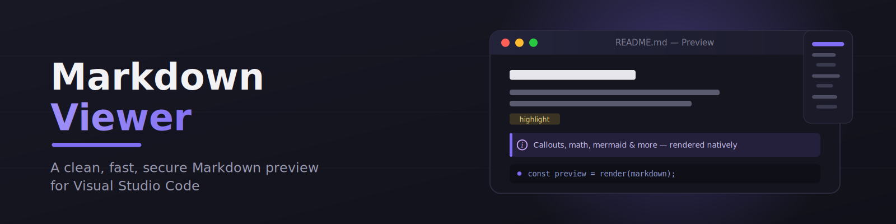

<p align="center">

</p>

<p align="center">
  
  
  
  
  
</p>

<p align="center"><strong>A dedicated Markdown preview panel for VS Code — Obsidian-style theming, Mermaid &amp; KaTeX, scroll sync, a live TOC, in-preview search, and one-click standalone HTML export. Fully offline, fully sandboxed.</strong></p>

---

## Contents

- [Features](#features)
- [Installation](#installation)
- [Usage](#usage)
- [Commands](#commands)
- [Configuration](#configuration)
- [Extended Markdown Syntax](#extended-markdown-syntax)
- [Keyboard Shortcuts](#keyboard-shortcuts)
- [Security Notes](#security-notes)
- [Development](#development)
- [Architecture Overview](#architecture-overview)
- [Roadmap](#roadmap)
- [License](#license)

---

## Features

### Core rendering
- Dedicated preview panel — open in the active editor group, or beside it
- **Live preview**: updates automatically as you edit, without a full reload
- Headings (h1–h6) with jump-link permalink anchors, paragraphs, bold/italic/bold-italic/strikethrough, inline code
- Unordered, ordered, and nested lists; GitHub-style task lists (`- [ ]` / `- [x]`) rendered as display-only checkboxes
- Links — external links (`http`, `https`, `mailto`) are intercepted and opened via VS Code's native "open externally" mechanism rather than navigating inside the preview
- Images, with relative paths resolved against the source document's location
- Blockquotes, including nested blockquotes
- Fenced code blocks with syntax highlighting (via highlight.js) and a hover-to-copy button
- Tables with column alignment, wrapped for horizontal scrolling on narrow viewports
- Horizontal rules
- Full VS Code theme integration (dark, light, high-contrast) via VS Code's own CSS theme variables — nothing is hardcoded

### Obsidian-style extras
- 💡 **Callouts** — `> [!info]`, `> [!warning]`, `> [!tip]`, and friends, rendered as collapsible colored panels
- 🖼️ **Image lightbox** — click any image to zoom
- 📋 **YAML frontmatter** — rendered as a properties card at the top of the document
- 📐 **KaTeX math** — offline rendering of inline `$math$` and block `$$math$$` expressions
- 🧩 **Mermaid diagrams** — offline rendering of ` ```mermaid ` fenced code blocks
- 📝 Footnotes, subscript/superscript

### New in v0.3 — reading &amp; navigation
- 🔄 **Bi-directional scroll sync** — scroll the editor and the preview follows, and vice versa
- 🗂️ **Interactive Table of Contents sidebar** with scroll-spy highlighting and click-to-jump navigation
- 🔍 **In-preview search** (`Ctrl+F` / `Cmd+F`) with match highlighting and Next/Previous navigation
- 📊 **Document stats footer** — word count, character count, and estimated reading time
- 📤 **Standalone HTML export** — one command produces a single self-contained `.html` file that opens in any browser, no VS Code required
- 🎨 **Custom CSS** — point the preview at your own stylesheet
- **Extended syntax** — `==highlight==`, `++inserted++`, definition lists, and `*[ABBR]: definition` abbreviations (see [Extended Markdown Syntax](#extended-markdown-syntax))

---

## Installation

### From a packaged `.vsix`

1. Run `npm install` and `npm run package` (see [Development](#development)) to produce a `.vsix` file.
2. In VS Code, open the Command Palette and run **Extensions: Install from VSIX...**, then select the file.

### From source, for development

See [Development](#development) — you can run the extension directly from an Extension Development Host without packaging it.

---

## Usage

1. Open a `.md` file in VS Code.
2. Run one of the [commands](#commands) below from the Command Palette (`Ctrl+Shift+P` / `Cmd+Shift+P`), or use the toolbar icon / keybinding.
3. The preview renders in a panel and updates automatically as you edit the source file.

---

## Commands

| Command | Description |
|---|---|
| `Markdown Viewer: Open Preview` | Opens the preview in the active editor group. |
| `Markdown Viewer: Open Preview to the Side` | Opens the preview beside the current editor. Also bound to `Ctrl+K V` / `Cmd+K V` and available as an icon in the editor toolbar. |
| `Markdown Viewer: Export to Standalone HTML` | Renders the current document to a single self-contained `.html` file (inline CSS, bundled Mermaid/KaTeX) that you can open in any browser or share without VS Code. |

All commands require the active editor to hold a Markdown (`.md`) document; otherwise an informational message is shown instead of a broken preview.

---

## Configuration

| Setting | Default | Description |
|---|---|---|
| `markdownViewer.syntaxHighlighting` | `true` | Enable syntax highlighting for fenced code blocks. |
| `markdownViewer.allowHtml` | `false` | Allow raw HTML in Markdown source to be rendered. Even when enabled, all HTML is sanitized before display — see [Security Notes](#security-notes). |
| `markdownViewer.maxContentWidth` | `900` | Maximum width, in pixels, of the rendered Markdown content, for readability on wide monitors. |
| `markdownViewer.showFrontmatter` | `true` | Show YAML frontmatter as a properties card at the top of the preview. |
| `markdownViewer.mermaid` | `true` | Enable Mermaid diagram rendering in fenced code blocks. |
| `markdownViewer.math` | `true` | Enable KaTeX math rendering for `$inline$` and `$$block$$` expressions. |
| `markdownViewer.scrollSync` | `true` | Synchronize scrolling bi-directionally between the editor and preview. |
| `markdownViewer.showToc` | `true` | Show the interactive Table of Contents sidebar in the preview. |
| `markdownViewer.showStats` | `true` | Show document statistics (word count, reading time) in the preview footer. |
| `markdownViewer.customStyles` | `""` | Path to a custom CSS file (relative to workspace, or absolute) to style the preview. |

---

## Extended Markdown Syntax

On top of standard Markdown, the following are supported out of the box:

| Syntax | Renders as | Example |
|---|---|---|
| `==text==` | `<mark>` highlight | `==important==` → <mark>important</mark> |
| `++text++` | `<ins>` inserted text | `++added++` → <ins>added</ins> |
| `Term`<br>`: Definition` | Definition list (`<dl>/<dt>/<dd>`) | `API`<br>`: Application Programming Interface` |
| `*[ABBR]: Full definition` | `<abbr>` with a hover tooltip, applied to every later occurrence of `ABBR` | `*[HTML]: HyperText Markup Language` |
| `> [!info]` / `[!warning]` / `[!tip]` / ... | Obsidian-style collapsible callout | `> [!warning]` <br> `> Be careful here.` |
| ` ```mermaid ` fenced block | Rendered diagram | flowcharts, sequence diagrams, etc. |
| `$inline$` / `$$block$$` | KaTeX-rendered math | `$E = mc^2$` |

---

## Keyboard Shortcuts

| Shortcut | Context | Action |
|---|---|---|
| `Ctrl+K V` / `Cmd+K V` | Editor | Open preview to the side |
| `Ctrl+F` / `Cmd+F` | Inside the preview panel | Open the in-preview find bar |
| `Enter` / `↓` | Find bar open | Jump to next match |
| `Shift+Enter` / `↑` | Find bar open | Jump to previous match |
| `Esc` | Find bar open | Close the find bar |

---

## Security Notes

The preview renders inside a VS Code Webview with security treated as a first-class concern:

- **Strict Content Security Policy**: `default-src 'none'`, with narrowly scoped `img-src`, `style-src`, and a nonce-based `script-src`. No `unsafe-inline` script and no `unsafe-eval`.
- **No arbitrary Webview navigation**: clicking a link never navigates the preview panel itself. External links (`http`, `https`, `mailto`) are intercepted and handed to VS Code's `vscode.env.openExternal`, which opens them in the system browser or mail client.
- **HTML sanitization**: all rendered HTML — including any raw HTML present in the Markdown source, if `markdownViewer.allowHtml` is enabled — is passed through DOMPurify before being placed in the Webview. Raw `<script>` tags and other unsafe constructs are stripped regardless of that setting.
- **Restricted resource roots**: the Webview may only load local resources from the Markdown document's own directory, its containing workspace folder, and (if configured) the directory of a custom CSS file — not the entire filesystem.
- **No code execution from Markdown**: code blocks are rendered as syntax-highlighted text only. Nothing in a Markdown document can execute JavaScript.

---

## Development

### Prerequisites

- Node.js 18+ and npm 9+
- Visual Studio Code

### Quick Setup (one command)

Clone the repo and run the setup script — it checks prerequisites, installs dependencies, compiles TypeScript, runs the linter, and verifies the build output:

```bash
git clone https://github.com/Jaiminsinh-Dodiya/MarkdownViewer.git
cd MarkdownViewer
node scripts/setup.js
```

> **Tip:** After the first `npm install`, you can also run `npm run setup` instead of `node scripts/setup.js`.

### Manual Setup

```bash
npm install
npm run compile
```

### Run the extension

Open this folder in VS Code and press `F5` (or run the **Run Extension** launch configuration). This compiles the extension and opens an Extension Development Host window with it loaded — open a `.md` file there and try the commands.

### Build

```bash
npm run compile   # one-off build
npm run watch      # incremental build on file change
```

### Lint

```bash
npm run lint
```

### Testing

```bash
npm test
```

This compiles the project, lints it, and runs the test suite inside a real VS Code instance via `@vscode/test-electron` (requires network access to download a VS Code test binary on first run). Tests cover:

- The Markdown engine (`test/markdown/`): every supported syntax feature — including the extended syntax and line-tagging — syntax-highlighting fallback for unknown languages, HTML sanitization, and resilience against malformed input.
- Webview URI resolution (`test/preview/`): relative image path resolution against the source document, and safe fallback behavior on resolution failure.

### Package

```bash
npm run package
```

Produces a `.vsix` file that can be installed via **Extensions: Install from VSIX...**.

---

## Architecture Overview

The extension is split into three layers with a strict one-way dependency direction: `extension.ts` → commands/preview → Markdown engine. The Markdown engine has **no dependency on the VS Code API**, so it can be tested, reused, or swapped independently of the editor integration.

```
markdown-viewer/
├── src/
│   ├── extension.ts              Activation only: wires commands, providers, listeners. Stays small.
│   ├── commands/                 Command registration (openPreview, openPreviewToSide, exportHtml).
│   ├── markdown/                 The Markdown engine — no VS Code dependency.
│   │   ├── MarkdownEngine.ts     Interface: render(source, options) -> RenderedMarkdown
│   │   ├── MarkdownRenderer.ts   markdown-it based implementation (highlighting, plugins, sanitization).
│   │   ├── LineTaggingPlugin.ts  Stamps data-line on block tokens, powering scroll sync.
│   │   ├── CalloutPlugin.ts      Obsidian-style `> [!type]` callout blocks.
│   │   ├── MarkdownTypes.ts      Shared types/options/errors.
│   │   └── MarkdownUtils.ts      Small pure helpers (slugify, escaping, URI classification).
│   ├── preview/                  Owns Webview lifecycle; connects documents to the engine.
│   │   ├── MarkdownPreviewProvider.ts   First load = full HTML shell; subsequent edits = incremental postMessage updates.
│   │   ├── WebviewContent.ts     Builds the HTML shell (TOC, search bar, stats footer, custom CSS tag).
│   │   └── WebviewSecurity.ts    CSP + nonce generation.
│   └── utils/                    VS Code-specific helpers (URI resolution, document detection).
├── media/                        Webview assets: preview.css, highlight-theme.css, preview.js.
└── test/                         Mirrors src/ for markdown and preview layers.
```

**Responsibility rules**, enforced by convention:

- `extension.ts` never contains rendering logic — only activation wiring.
- The Markdown engine never imports `vscode` — resource resolution is injected via a callback (`MarkdownRenderOptions.resolveResourcePath`) supplied by the preview layer.
- The preview provider never contains Markdown parsing logic — it only connects documents, the engine, and the Webview.

This separation is what allows future capabilities (GitHub-flavored Markdown, a documentation graph, GitHub API integration) to be added as new engine implementations or new provider layers without rewriting the rendering core.

---

## Roadmap

Deliberately **not** implemented yet, but the architecture is intended to accommodate these without a rewrite:

- GitHub-flavored Markdown extensions (like advanced tables or citations)
- Interactive/editable task lists
- Git repository awareness and relative-document navigation
- Broken-link detection and a Markdown document graph
- GitHub API integration: repositories, issues, pull requests, Actions
- Documentation validation/search

### Non-Goals

To keep this project focused, the following are explicitly out of scope: GitHub API/auth/Actions, Git integration, an issue/PR viewer, a Markdown editor or formatting commands, a repository graph, documentation search, publishing, cloud sync, AI features, remote/online rendering, and any external backend or server. This is, and is meant to stay, a **local, offline Markdown viewer**.

---

## License

[MIT](LICENSE)
