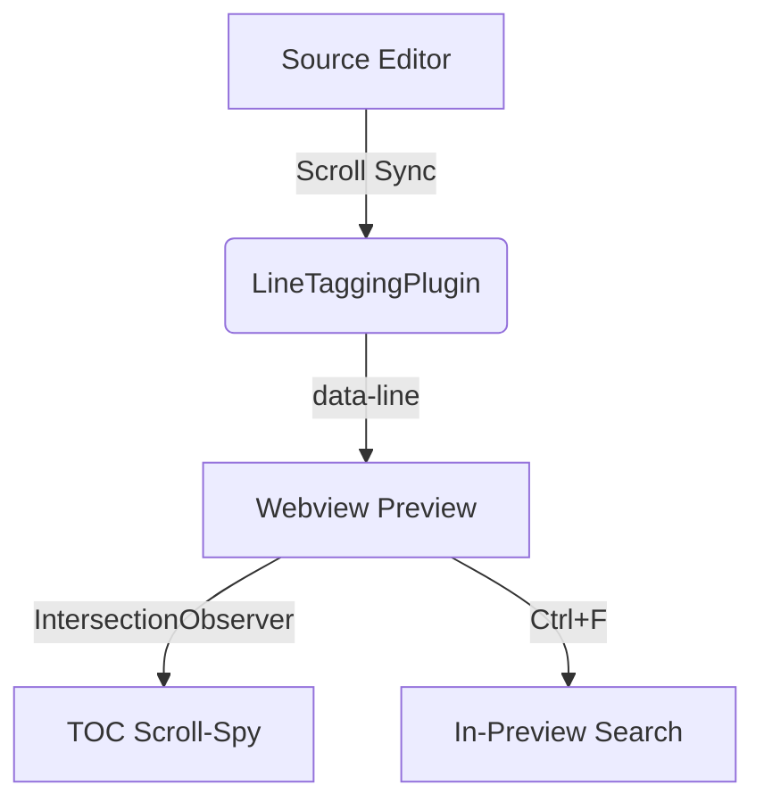

# 🚀 Markdown Viewer (v0.3.0) — Comprehensive Feature Tour

Welcome to **Markdown Viewer**! This document showcases every single feature supported by your extension.

---

## 📑 1. Interactive Table of Contents & Scroll Sync

Click the **TOC icon** in the top-right toolbar (or press the toggle button) to open the sliding Table of Contents sidebar. As you scroll through this document, the active section will automatically highlight!

Try scrolling in the VS Code source editor — the preview panel will scroll to match your exact line position automatically.

---

## 📦 2. Obsidian Callout Blocks

Obsidian callouts support 13 distinct types with custom icons and left border accents:

> [!note] Quick Note
> This is a standard note callout block styled with Obsidian's design system.

> [!warning]+ Collapsible Warning (Click title to toggle!)
> This callout is collapsible! Click anywhere on the title bar above to fold or expand its content.

> [!tip] Pro Tip
> Use callouts to draw attention to critical hints and best practices in your technical docs.

> [!danger] Danger Ahead
> Take caution before running destructive terminal commands or database migrations.

> [!question] FAQ Question
> Can I export this preview to standalone HTML? Yes! Use the `Markdown Viewer: Export to Standalone HTML` command.

> [!example] Worked Example
> Callouts render smoothly with full inline Markdown support inside them.

---

## 📝 3. Rich Typography & Extended Syntax

Standard Markdown formatting combined with extended syntax extensions:

- **Bold & Italic**: **Bold text**, *Italic text*, and ***Bold-Italic***
- **Strikethrough**: ~~Outdated text~~
- **Highlight Text**: ==Highlighted key terms== using `==text==`
- **Inserted Text**: ++Newly added text++ using `++text++`
- **Subscript & Superscript**: H~2~O and 2^10^ = 1024
- **Emoji Shortcodes**: :smile: :rocket: :fire: :zap: :checkered_flag: :heart:

---

## 💻 4. Code Blocks with Hover-Reveal Copy Button

Hover over the top-right corner of the code block below to reveal the **Copy** button. Click it to copy the raw source code directly to your clipboard:

```typescript
interface ExtensionConfig {
  syntaxHighlighting: boolean;
  scrollSync: boolean;
  showToc: boolean;
  showStats: boolean;
}

function initializeExtension(config: ExtensionConfig): void {
  console.log(`Markdown Viewer v0.3.0 active with scrollSync: ${config.scrollSync}`);
}

initializeExtension({
  syntaxHighlighting: true,
  scrollSync: true,
  showToc: true,
  showStats: true
});
```

---

## 📊 5. Local Offline Mermaid Diagrams

Render complex diagrams directly using client-side SVG rendering (works 100% offline):



---

## 🧮 6. KaTeX Math Equations

Inline LaTeX math: $E = mc^2$ and Euler's formula $e^{i\pi} + 1 = 0$.

Block LaTeX math equations:

$$ \int_{-\infty}^{\infty} e^{-x^2} dx = \sqrt{\pi} $$

$$ A = \begin{pmatrix} a & b \\ c & d \end{pmatrix} $$

---

## 🔍 7. In-Preview Search / Find Bar (`Ctrl + F`)

Click inside the preview panel and press **`Ctrl + F`** (or `Cmd + F` on macOS), or click the Search icon in the top toolbar to launch the floating search bar:

- Type any query (e.g. `Obsidian` or `scroll`).
- Cycle matches with **`Enter`** (Next) or **`Shift + Enter`** (Previous).
- View live match counter (`3 of 12`).
- Press **`Esc`** to close.

---

## 📊 8. Responsive Tables

Tables render with clean borders, bold headers, and zebra-striped rows:

| Feature | Support | Mode | Description |
| :--- | :---: | :---: | :--- |
| Scroll Sync | ✅ | Bi-Directional | Syncs editor line to preview position |
| Callout Blocks | ✅ | Obsidian | 13 types with collapse support |
| Mermaid Diagrams | ✅ | SVG | Local offline vector diagramming |
| KaTeX Math | ✅ | TeX | Inline & block LaTeX rendering |
| Standalone Export | ✅ | HTML | Single self-contained `.html` file |

---

## 📑 9. Footnotes, Definitions & Abbreviations

Here is a statement with a footnote reference[^1].

Term 1
: Definition of Term 1 goes here.

Term 2
: Definition of Term 2 with detailed explanation.

The HTML standard is maintained by W3C.

*[HTML]: HyperText Markup Language
*[W3C]: World Wide Web Consortium

[^1]: Footnote detail text rendered at the bottom of the document with a return link ↩.

---

## 🖼️ 10. Click-to-Zoom Image Lightbox

Click any image in the preview to pop it open into a centered dark overlay modal. Press `Esc` or click anywhere on the backdrop to dismiss:


bfggf
---

## 📊 11. Document Statistics Footer

Look at the bottom of this preview panel! The footer automatically displays your live document metrics: **word count**, **character count**, **line count**, and **estimated reading time** (`450 words • 3,200 chars • 75 lines • 2 min read`).
